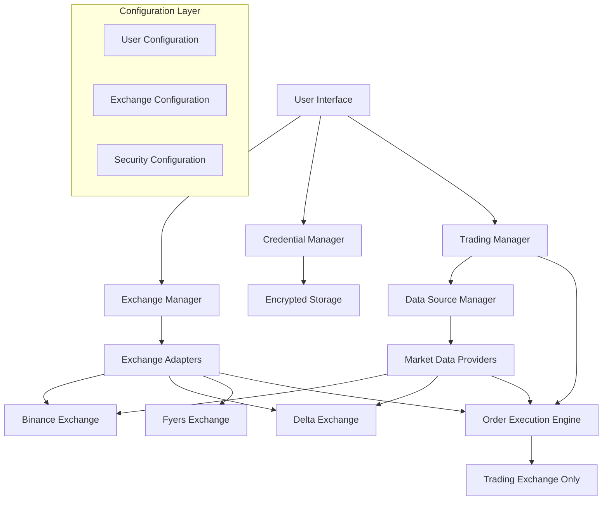

# Design Document

## Overview

The Multi-Exchange Trading System will enhance the existing AlgoTradeHub platform by implementing a flexible architecture that allows users to select their preferred trading exchange while maintaining optimal market data sourcing. The system will support both cryptocurrency and stock trading across multiple exchanges with secure credential management and automated currency handling.

## Architecture

### High-Level Architecture



### Core Components

1. **Exchange Manager**: Central hub for managing exchange configurations and selections
2. **Market Data Manager**: Intelligent routing for optimal data sourcing
3. **Trading Execution Engine**: Secure order execution on selected exchange only
4. **Credential Manager**: Encrypted storage and management of API credentials
5. **Currency Handler**: Automatic conversion between different base currencies
6. **Exchange Adapters**: Standardized interfaces for different exchange types

## Components and Interfaces

### 1. Exchange Manager

**Purpose**: Manage exchange configurations, user selections, and exchange metadata.

**Key Classes**:
```python
class ExchangeManager:
    def __init__(self):
        self.supported_exchanges = {}
        self.user_selected_exchange = None
        self.default_exchange = None
    
    def get_supported_exchanges(self) -> Dict[str, ExchangeInfo]
    def set_user_exchange(self, exchange_name: str) -> bool
    def set_default_exchange(self, exchange_name: str) -> bool
    def get_exchange_info(self, exchange_name: str) -> ExchangeInfo
    def validate_exchange_support(self, exchange_name: str, asset_type: str) -> bool
```

**Exchange Configuration Structure**:
```yaml
exchanges:
  binance:
    type: "crypto"
    base_currency: "USDT"
    supported_assets: ["BTC", "ETH", "BNB", "ADA"]
    features: ["spot", "futures", "options"]
    api_requirements: ["api_key", "secret"]
    sandbox_available: true
  
  delta:
    type: "crypto"
    base_currency: "INR"
    supported_assets: ["BTC", "ETH", "SOL"]
    features: ["spot", "futures"]
    api_requirements: ["api_key", "secret"]
    sandbox_available: true
  
  fyers:
    type: "stock"
    base_currency: "INR"
    supported_assets: ["NIFTY", "BANKNIFTY", "RELIANCE"]
    features: ["equity", "derivatives"]
    api_requirements: ["api_key", "secret", "client_id"]
    sandbox_available: true
```

### 2. Market Data Manager

**Purpose**: Intelligently route market data requests to the most reliable source.

**Key Classes**:
```python
class MarketDataManager:
    def __init__(self):
        self.data_sources = {}
        self.source_rankings = {}
        self.fallback_sources = {}
    
    def get_optimal_data_source(self, symbol: str) -> str
    def fetch_market_data(self, symbol: str, timeframe: str) -> MarketData
    def get_order_book(self, symbol: str) -> OrderBook
    def get_price_history(self, symbol: str, period: str) -> PriceHistory
    def register_fallback_source(self, primary: str, fallback: str)
```

**Data Source Priority Logic**:
1. **Reliability Score**: Based on uptime and data accuracy
2. **Latency**: Response time for real-time data
3. **Coverage**: Symbol availability and data completeness
4. **Cost**: API rate limits and usage costs

### 3. Trading Execution Engine

**Purpose**: Execute trades only on the user-selected exchange with proper security.

**Key Classes**:
```python
class TradingExecutionEngine:
    def __init__(self, exchange_manager: ExchangeManager, credential_manager: CredentialManager):
        self.exchange_manager = exchange_manager
        self.credential_manager = credential_manager
        self.active_exchange = None
    
    def execute_order(self, order: Order) -> ExecutionResult
    def validate_credentials(self, exchange_name: str) -> bool
    def get_account_balance(self) -> Balance
    def get_open_positions(self) -> List[Position]
    def cancel_order(self, order_id: str) -> bool
```

**Order Execution Flow**:
1. Validate user credentials for selected exchange
2. Convert order parameters to exchange-specific format
3. Handle currency conversion if needed
4. Execute order on selected exchange only
5. Return standardized execution result

### 4. Credential Manager

**Purpose**: Securely store and manage API credentials for different exchanges.

**Key Classes**:
```python
class CredentialManager:
    def __init__(self, encryption_key: str):
        self.encryption_key = encryption_key
        self.credentials_store = {}
    
    def store_credentials(self, exchange: str, credentials: Dict) -> bool
    def get_credentials(self, exchange: str) -> Dict
    def validate_credentials(self, exchange: str) -> bool
    def delete_credentials(self, exchange: str) -> bool
    def encrypt_data(self, data: str) -> str
    def decrypt_data(self, encrypted_data: str) -> str
```

**Security Features**:
- AES-256 encryption for credential storage
- Local file-based storage (no cloud dependencies)
- Automatic credential validation
- Secure memory handling for sensitive data

### 5. Exchange Adapters

**Purpose**: Provide standardized interfaces for different exchange types and APIs.

**Base Adapter Interface**:
```python
class ExchangeAdapter(ABC):
    @abstractmethod
    def connect(self, credentials: Dict) -> bool
    
    @abstractmethod
    def get_market_data(self, symbol: str) -> MarketData
    
    @abstractmethod
    def place_order(self, order: Order) -> ExecutionResult
    
    @abstractmethod
    def get_account_info(self) -> AccountInfo
    
    @abstractmethod
    def get_supported_symbols(self) -> List[str]
```

**Specific Adapters**:
- **BinanceAdapter**: Cryptocurrency trading with USDT base
- **DeltaAdapter**: Cryptocurrency trading with INR base
- **FyersAdapter**: Stock trading with INR base
- **GenericCCXTAdapter**: Fallback for other CCXT-supported exchanges

## Data Models

### Core Data Models

```python
@dataclass
class ExchangeInfo:
    name: str
    display_name: str
    type: str  # "crypto" or "stock"
    base_currency: str
    supported_assets: List[str]
    features: List[str]
    api_requirements: List[str]
    sandbox_available: bool
    rate_limits: Dict[str, int]

@dataclass
class UserExchangePreference:
    selected_exchange: str
    default_exchange: str
    live_trading_enabled: bool
    preferred_data_sources: Dict[str, str]
    currency_preferences: Dict[str, str]

@dataclass
class MarketData:
    symbol: str
    price: float
    volume: float
    timestamp: datetime
    bid: float
    ask: float
    source_exchange: str

@dataclass
class Order:
    symbol: str
    side: str  # "buy" or "sell"
    type: str  # "market", "limit", "stop"
    quantity: float
    price: Optional[float]
    exchange: str
    currency: str

@dataclass
class ExecutionResult:
    order_id: str
    status: str
    filled_quantity: float
    average_price: float
    commission: float
    timestamp: datetime
    exchange: str
```

### Database Schema Extensions

```sql
-- Exchange preferences table
CREATE TABLE user_exchange_preferences (
    id INTEGER PRIMARY KEY,
    user_id INTEGER,
    selected_exchange VARCHAR(50),
    default_exchange VARCHAR(50),
    live_trading_enabled BOOLEAN DEFAULT FALSE,
    preferences JSON,
    created_at TIMESTAMP DEFAULT CURRENT_TIMESTAMP,
    updated_at TIMESTAMP DEFAULT CURRENT_TIMESTAMP
);

-- Market data sources table
CREATE TABLE market_data_sources (
    id INTEGER PRIMARY KEY,
    symbol VARCHAR(20),
    primary_source VARCHAR(50),
    fallback_sources JSON,
    reliability_score FLOAT,
    last_updated TIMESTAMP
);

-- Exchange credentials (encrypted)
CREATE TABLE exchange_credentials (
    id INTEGER PRIMARY KEY,
    exchange_name VARCHAR(50),
    encrypted_credentials TEXT,
    is_validated BOOLEAN DEFAULT FALSE,
    last_validated TIMESTAMP,
    created_at TIMESTAMP DEFAULT CURRENT_TIMESTAMP
);
```

## Error Handling

### Error Categories and Handling

1. **Connection Errors**:
   - Network timeouts
   - Exchange API downtime
   - Rate limit exceeded
   - **Handling**: Automatic retry with exponential backoff, fallback to alternative data sources

2. **Authentication Errors**:
   - Invalid API credentials
   - Expired tokens
   - Insufficient permissions
   - **Handling**: Clear error messages, credential re-validation prompts

3. **Trading Errors**:
   - Insufficient balance
   - Invalid order parameters
   - Market closed
   - **Handling**: Pre-validation checks, clear error messages, suggested corrections

4. **Data Errors**:
   - Missing market data
   - Stale data
   - Symbol not found
   - **Handling**: Fallback data sources, data validation, user notifications

### Error Response Format

```python
@dataclass
class ErrorResponse:
    error_code: str
    error_message: str
    error_type: str
    suggested_action: str
    retry_possible: bool
    fallback_available: bool
```

## Testing Strategy

### Unit Testing

1. **Exchange Manager Tests**:
   - Exchange selection and validation
   - Configuration loading and saving
   - Default exchange management

2. **Market Data Manager Tests**:
   - Data source selection logic
   - Fallback mechanism
   - Data validation and formatting

3. **Trading Engine Tests**:
   - Order execution simulation
   - Currency conversion logic
   - Error handling scenarios

4. **Credential Manager Tests**:
   - Encryption/decryption functionality
   - Secure storage and retrieval
   - Credential validation

### Integration Testing

1. **Exchange Integration Tests**:
   - Real API connections (sandbox mode)
   - Data fetching from multiple sources
   - Order placement and execution

2. **End-to-End Testing**:
   - Complete trading workflows
   - Multi-exchange data aggregation
   - User preference persistence

### Mock Testing Framework

```python
class MockExchangeAdapter:
    def __init__(self, exchange_name: str):
        self.exchange_name = exchange_name
        self.mock_data = self.load_mock_data()
    
    def simulate_market_data(self, symbol: str) -> MarketData
    def simulate_order_execution(self, order: Order) -> ExecutionResult
    def simulate_connection_error(self)
    def simulate_authentication_error(self)
```

## Security Considerations

### Credential Security

1. **Encryption**: AES-256 encryption for all stored credentials
2. **Key Management**: Secure key derivation from user password
3. **Memory Protection**: Clear sensitive data from memory after use
4. **Access Control**: Credentials accessible only to authenticated users

### API Security

1. **Rate Limiting**: Respect exchange rate limits
2. **Request Signing**: Proper HMAC signing for authenticated requests
3. **SSL/TLS**: Enforce secure connections to all exchanges
4. **IP Whitelisting**: Support for exchange IP restrictions

### Data Protection

1. **Local Storage**: All sensitive data stored locally
2. **No Cloud Dependencies**: No external services for credential storage
3. **Audit Logging**: Log all credential access and trading activities
4. **Data Encryption**: Encrypt configuration files containing sensitive data

## Performance Optimization

### Caching Strategy

1. **Market Data Caching**: Cache frequently requested market data
2. **Exchange Info Caching**: Cache exchange metadata and configurations
3. **Credential Caching**: Secure in-memory caching of validated credentials

### Connection Pooling

1. **WebSocket Connections**: Maintain persistent connections for real-time data
2. **HTTP Connection Reuse**: Pool HTTP connections for API requests
3. **Connection Health Monitoring**: Monitor and reconnect failed connections

### Asynchronous Operations

1. **Async Data Fetching**: Non-blocking market data requests
2. **Concurrent Order Processing**: Handle multiple orders simultaneously
3. **Background Tasks**: Periodic data updates and health checks

## Configuration Management

### User Configuration Structure

```yaml
user_preferences:
  selected_exchange: "binance"
  default_exchange: "binance"
  live_trading: false
  
market_data:
  preferred_sources:
    "BTC/USDT": "binance"
    "ETH/USDT": "kraken"
  fallback_enabled: true
  cache_duration: 300  # seconds

trading:
  currency_conversion: true
  order_confirmation: true
  risk_management: true
  
security:
  credential_timeout: 3600  # seconds
  auto_logout: true
  encryption_enabled: true
```

### Exchange-Specific Configurations

Each exchange adapter will have its own configuration section with:
- API endpoints and versions
- Rate limits and timeouts
- Supported features and symbols
- Currency conversion rates
- Error handling preferences

This design provides a robust, secure, and flexible foundation for the multi-exchange trading system while maintaining the existing AlgoTradeHub architecture and adding the requested functionality.